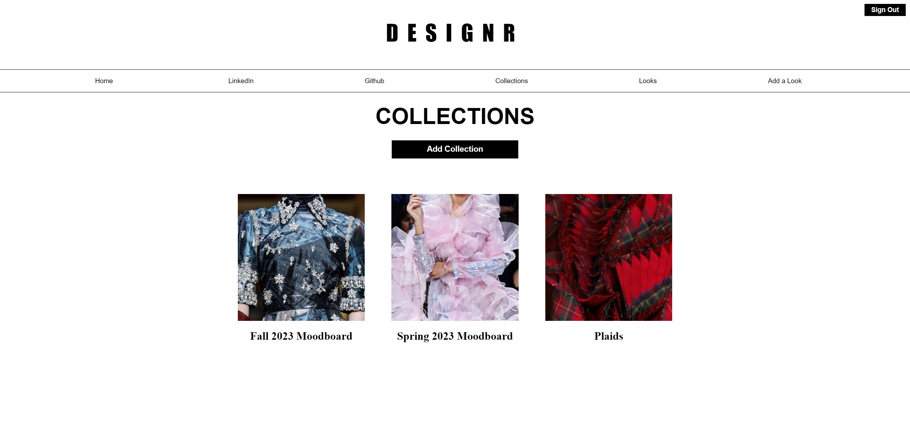

# ĐESIGNR

Live link: https://designr-flickr-clone.herokuapp.com/
Github Wiki: https://github.com/dannytoan/designr-react-solo-project/wiki

## About
***
ĐESIGNR is a fashion/runway themed Flickr clone with the goal of being the one-stop destination for fashion enthusiasts to browse looks from past and current runway collections.

In this web application, users are able to upload their own images of "Looks" to their own accounts and compile their own inspired customized "Collections" (albums).

## Building Instructions
***
1. Download the repository from GitHub [here](https://github.com/dannytoan/designr-react-solo-project).
2. Navigate into both the `frontend` and `backend` directories and run `npm install` to download the necessary dependencies.
3. In the `backend` directory, create an `.env` file with appropriate corresponding data to the already existing `.env.example` file.
4. Run `npx dotenv sequelize db:migrate` and `npx dotenv sequelize db:seed:all` to migrate and seed the database.
5. In both the `frontend` and `backend` directories in seperate terminals, run `npm start` to start the server and to view the site on localhost 3000.

## Future Features
***
- Comments
- Likes
- Favorites

## Technical Implementation Details
***
Database design planning was crucial in prior steps to starting this project.
- Understanding the associations between the necessary tables was required to making this application intuitive and functional.

## Demonstration
***
Welcome page as an unauthorized user:

Welcome page as an authorized & logged in user:

"Looks" page displaying all of the images in the database:

Photo detail page:

Upload a photo page:

Collections/album page:

Adding a new collection:

Collection detail page:

## Technolgies Used
***

